# TORQUE 360 -- Enterprise Architecture Document

**Version:** 1.0.0
**Date:** 2026-02-17
**Classification:** Internal -- Confidential
**Author:** Jose Antonio (CTO/Founder) + Genie AI System

---

## Table of Contents

1. [Executive Vision](#1-executive-vision)
2. [Core Architecture Principles](#2-core-architecture-principles)
3. [System Architecture Overview](#3-system-architecture-overview)
4. [Database Architecture](#4-database-architecture)
5. [Module Architecture (Domain-Driven Design)](#5-module-architecture-domain-driven-design)
6. [Data Export and Snapshot System](#6-data-export-and-snapshot-system)
7. [API Architecture](#7-api-architecture)
8. [Security Architecture](#8-security-architecture)
9. [Scalability Plan](#9-scalability-plan)
10. [Technology Decisions](#10-technology-decisions)
11. [Deployment Architecture](#11-deployment-architecture)
12. [Competitive Positioning](#12-competitive-positioning)
13. [Appendix A: Entity Relationship Summary](#appendix-a-entity-relationship-summary)
14. [Appendix B: Glossary](#appendix-b-glossary)

---

## 1. Executive Vision

TORQUE 360 is an enterprise-grade, cloud-native ERP built exclusively for the Latin American automotive industry. It targets service workshops (talleres), dealerships (concesionarios), and parts importers (importadoras) across Chile and LATAM.

The system is designed to combine three qualities that no existing automotive ERP delivers together:

- **The solidity and trust of SAP** -- ACID transactions, double-entry accounting readiness, complete audit trails, financial compliance, and SOX-readiness through immutable hash-chained logs.
- **The adaptability of Microsoft Dynamics** -- A modular monolith with plugin-ready architecture, customizable workflows, multi-tenant with per-tenant configuration, and an extensible approval engine.
- **The power of Oracle** -- Massive database handling through partitioned tables, materialized views for real-time OLAP, and time-travel snapshots that can reconstruct an exact picture of the company at any point in time.

The result is an ERP that costs $49-499/month (vs $300-5,000+ for competitors), runs on modern cloud infrastructure, and delivers features that legacy systems cannot match -- including AI-powered diagnostics and a B2B inter-workshop parts marketplace (TORQUE Network).

---

## 2. Core Architecture Principles

### 2.1 SAP-Level Reliability

| Principle | Implementation |
|-----------|---------------|
| ACID Transactions | Every business operation (OT creation, invoice generation, stock movement) runs inside a PostgreSQL transaction with SERIALIZABLE isolation where needed |
| Double-Entry Readiness | Financial mutations always produce balanced debit/credit pairs in the general ledger module (Phase 2), with reconciliation checks |
| Complete Audit Trails | Every data mutation is logged in `audit_logs` with: user_id, entity_type, entity_id, action, old/new values (JSONB changes), IP, timestamp, and a SHA-256 hash chain (`prev_hash` -> `hash`) that makes tampering detectable |
| SOX Compliance Readiness | Separation of duties enforced via RBAC, approval workflows for financial operations, immutable audit logs, and data retention policies aligned with Chilean Ley 19.628 and Ley 21.719 |
| Referential Integrity | Full foreign key constraints across all 51+ tables; no orphaned records allowed |

### 2.2 Dynamics-Level Adaptability

| Principle | Implementation |
|-----------|---------------|
| Modular Monolith | 28 NestJS modules organized as bounded contexts; each module owns its entities, services, controllers, and DTOs. Modules communicate via well-defined service interfaces, not direct DB queries across boundaries |
| Plugin-Ready Architecture | Tenant `settings` JSONB column allows per-tenant feature flags, custom field definitions, and workflow overrides without schema changes |
| Customizable Workflows | The `automation_rules` table and `ApprovalsModule` enable trigger-based workflows (e.g., "if discount > 15%, require MANAGER approval") configurable per tenant |
| Multi-Tenant with Per-Tenant Config | Every tenant can customize: DTE types, tax settings, warehouse structures, role permissions, notification preferences, approval thresholds, and branding -- all stored in the tenant settings JSONB |
| Extensible Approval Engine | Multi-level approval workflows for quotes, purchase orders, discounts, and credit notes -- configurable per tenant and role hierarchy |

### 2.3 Oracle-Level Data Power

| Principle | Implementation |
|-----------|---------------|
| Partitioned Tables | Large tables (audit_logs, stock_movements, invoices) will be partitioned by tenant_id (hash partition) and by date (range partition) for query performance at scale |
| Materialized Views | Pre-computed dashboard data (revenue by period, inventory turnover, technician productivity) refreshed on schedule or on-demand via background workers |
| Real-Time OLAP | Redis-cached KPI aggregations updated by event-driven triggers; PostgreSQL `pg_stat_statements` monitored for query optimization |
| Time-Travel Snapshots | Temporal tables with system-versioned history allow point-in-time queries: "Show me the inventory state as of March 15, 2025" |
| Full-Text Search | PostgreSQL `tsvector` + `pg_trgm` for parts catalog search with fuzzy matching; Meilisearch for typo-tolerant, instant search across all entities |

---

## 3. System Architecture Overview

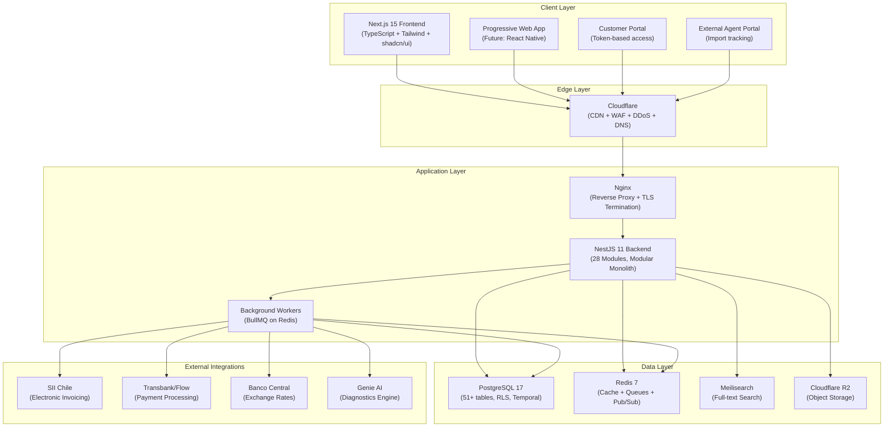

### 3.1 Architecture Style: Modular Monolith

TORQUE 360 follows a **modular monolith** pattern rather than microservices. This is a deliberate decision:

**Why not microservices:**
- Team size (1-2 developers) does not justify the operational complexity of distributed systems.
- A monorepo with Turborepo provides the same code organization benefits.
- Cross-module transactions (e.g., creating an invoice that deducts inventory and updates the work order) are trivially consistent in a monolith, but require sagas/compensations in microservices.
- PostgreSQL RLS provides tenant isolation at the data layer -- no need for per-tenant service instances.

**Why modular monolith specifically:**
- Each of the 28 NestJS modules is a bounded context with clear boundaries.
- Modules communicate through injected service interfaces, never through direct database queries outside their boundary.
- If a module needs to become a separate service in the future (e.g., the TORQUE Network B2B marketplace), it can be extracted with minimal refactoring because its API surface is already well-defined.
- The monorepo structure (`apps/api`, `apps/web`, `packages/shared`) enforces clean separation.

### 3.2 Monorepo Structure

```
Torque360/
├── apps/
│   ├── api/                          # NestJS 11 Backend
│   │   ├── src/
│   │   │   ├── main.ts               # Bootstrap + global config
│   │   │   ├── app.module.ts          # Root module, imports all 28 modules
│   │   │   ├── common/               # Cross-cutting concerns
│   │   │   │   ├── guards/           # JwtAuthGuard, RolesGuard, TenantGuard
│   │   │   │   ├── decorators/       # @CurrentUser, @Roles, @TenantId
│   │   │   │   ├── interceptors/     # AuditInterceptor, TenantInterceptor
│   │   │   │   └── filters/          # HttpExceptionFilter
│   │   │   ├── modules/              # 28 business modules (see Section 5)
│   │   │   └── database/
│   │   │       ├── entities/         # 44+ TypeORM entities
│   │   │       ├── migrations/       # Versioned SQL migrations
│   │   │       ├── seeds/            # Demo and test data
│   │   │       └── init.sql          # Base schema + RLS policies
│   │   ├── Dockerfile
│   │   └── package.json
│   └── web/                          # Next.js 15 Frontend
│       ├── src/
│       │   ├── app/                  # App Router pages (20+ routes)
│       │   ├── components/           # shadcn/ui + custom components
│       │   └── lib/                  # API client, auth helpers
│       ├── Dockerfile
│       └── package.json
├── packages/
│   ├── shared/                       # Shared TypeScript types + constants
│   │   └── src/types/               # tenant, inventory, client, work-order, etc.
│   └── blockchain-interfaces/        # Abstract ledger/audit interfaces
├── deploy/
│   ├── nginx/                        # Reverse proxy + TLS config
│   └── scripts/                      # deploy.sh (staging/production)
├── docker-compose.yml                # Dev: PG17 + Redis7 + Meilisearch
├── docker-compose.prod.yml           # Prod: full stack with resource limits
├── turbo.json                        # Turborepo pipeline config
├── pnpm-workspace.yaml               # Workspace definition
└── .github/workflows/                # CI/CD pipelines
```

---

## 4. Database Architecture

### 4.1 PostgreSQL 17 -- Primary Data Store

PostgreSQL 17 was chosen as the single source of truth for all structured data. It serves as both the OLTP (transactional) and OLAP (analytical) engine, avoiding the cost and complexity of a separate analytics database at this stage.

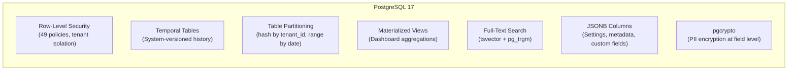

#### Row-Level Security (RLS)

RLS is the foundation of multi-tenant data isolation. Every table with tenant-scoped data has RLS enabled, and a policy ensures queries only return rows matching the current tenant:

```sql
-- Helper function: reads tenant from session variable
CREATE OR REPLACE FUNCTION current_tenant_id() RETURNS UUID AS $$
  SELECT current_setting('app.current_tenant_id', true)::UUID;
$$ LANGUAGE SQL STABLE;

-- Policy applied to all tenant-scoped tables (49 policies total)
CREATE POLICY tenant_isolation_vehicles ON vehicles
  USING (tenant_id = current_tenant_id())
  WITH CHECK (tenant_id = current_tenant_id());
```

The `TenantGuard` in NestJS sets this session variable on every authenticated request:

```
SET LOCAL app.current_tenant_id = '<uuid from JWT>';
```

The application connects to PostgreSQL using a non-superuser role (`torque_app`) that respects RLS policies. `SUPER_ADMIN` users can target a specific tenant via the `X-Tenant-Id` header.

**Tables with RLS enabled (current):** users, vehicles, clients, work_orders, work_order_parts, quotations, inventory_items, audit_logs, warehouses, warehouse_locations, stock_movements, suppliers, invoices, invoice_items, caf_folios, employees, payrolls, payroll_details, notifications, automation_rules, approvals, companies, and all other tenant-scoped tables.

#### Temporal Tables (Time-Travel)

For point-in-time queries ("Show me inventory as of March 15, 2025"), critical tables implement system-versioned temporal history:

```sql
-- Example: inventory_items_history
CREATE TABLE inventory_items_history (
  LIKE inventory_items INCLUDING ALL,
  valid_from TIMESTAMPTZ NOT NULL DEFAULT NOW(),
  valid_to TIMESTAMPTZ NOT NULL DEFAULT 'infinity'::TIMESTAMPTZ,
  operation CHAR(1) NOT NULL  -- I=insert, U=update, D=delete
);

-- Trigger: on every UPDATE/DELETE, copy old row to history
CREATE OR REPLACE FUNCTION track_inventory_changes()
RETURNS TRIGGER AS $$
BEGIN
  IF TG_OP = 'UPDATE' THEN
    INSERT INTO inventory_items_history
    SELECT OLD.*, OLD.updated_at, NOW(), 'U';
  ELSIF TG_OP = 'DELETE' THEN
    INSERT INTO inventory_items_history
    SELECT OLD.*, OLD.updated_at, NOW(), 'D';
  END IF;
  RETURN NEW;
END;
$$ LANGUAGE plpgsql;

-- Point-in-time query
SELECT * FROM inventory_items_history
WHERE tenant_id = :tenant_id
  AND valid_from <= '2025-03-15'::TIMESTAMPTZ
  AND valid_to > '2025-03-15'::TIMESTAMPTZ;
```

**Tables with temporal history:** inventory_items, work_orders, invoices, clients, vehicles, employees, payrolls, stock_movements.

#### Table Partitioning Strategy

As the system scales beyond 100 tenants and millions of rows, large tables will be partitioned:

| Table | Partition Strategy | Rationale |
|-------|-------------------|-----------|
| audit_logs | RANGE by `created_at` (monthly) | Write-heavy, append-only, queries always filter by date range |
| stock_movements | RANGE by `created_at` (monthly) | High volume, historical queries by period |
| invoices | RANGE by `created_at` (quarterly) | SII reporting is quarterly; partition aligns with query patterns |
| inventory_items_history | RANGE by `valid_from` (monthly) | Temporal history grows unbounded; old partitions can be archived |

Hash partitioning by `tenant_id` will be applied to the hottest tables when tenant count exceeds 500, to distribute I/O evenly across partitions.

#### Materialized Views for Dashboards

Pre-computed aggregations avoid expensive real-time calculations:

```sql
-- Example: daily revenue summary per tenant
CREATE MATERIALIZED VIEW mv_daily_revenue AS
SELECT
  tenant_id,
  DATE(created_at) AS date,
  COUNT(*) AS invoice_count,
  SUM(total) AS total_revenue,
  SUM(CASE WHEN status = 'PAID' THEN total ELSE 0 END) AS collected_revenue,
  AVG(total) AS avg_invoice_value
FROM invoices
WHERE status NOT IN ('VOID', 'DRAFT')
GROUP BY tenant_id, DATE(created_at);

-- Refreshed by background worker every 15 minutes
-- Or on-demand via REFRESH MATERIALIZED VIEW CONCURRENTLY mv_daily_revenue;
```

**Materialized views planned:**
- `mv_daily_revenue` -- Revenue metrics by day
- `mv_inventory_valuation` -- Current stock value by category
- `mv_technician_productivity` -- Hours, OTs completed, revenue per technician
- `mv_customer_retention` -- Return visit rates, average ticket
- `mv_parts_demand` -- Most-used parts, reorder frequency
- `mv_pipeline_conversion` -- Sales funnel conversion rates

#### Full-Text Search

PostgreSQL's built-in FTS handles parts catalog search without requiring ElasticSearch:

```sql
-- tsvector column on inventory_items
ALTER TABLE inventory_items ADD COLUMN search_vector tsvector;

UPDATE inventory_items SET search_vector =
  setweight(to_tsvector('spanish', coalesce(name, '')), 'A') ||
  setweight(to_tsvector('simple', coalesce(part_number, '')), 'A') ||
  setweight(to_tsvector('simple', coalesce(oem_number, '')), 'A') ||
  setweight(to_tsvector('spanish', coalesce(description, '')), 'B') ||
  setweight(to_tsvector('simple', coalesce(sku, '')), 'B');

CREATE INDEX idx_inventory_fts ON inventory_items USING GIN(search_vector);

-- Fuzzy matching with pg_trgm for typo tolerance
CREATE EXTENSION IF NOT EXISTS pg_trgm;
CREATE INDEX idx_inventory_trgm ON inventory_items USING GIN(name gin_trgm_ops);
```

Meilisearch complements PostgreSQL FTS for the frontend instant-search experience (typo-tolerant, faceted, sub-50ms latency).

### 4.2 Redis 7 -- Cache, Queues, and Real-Time

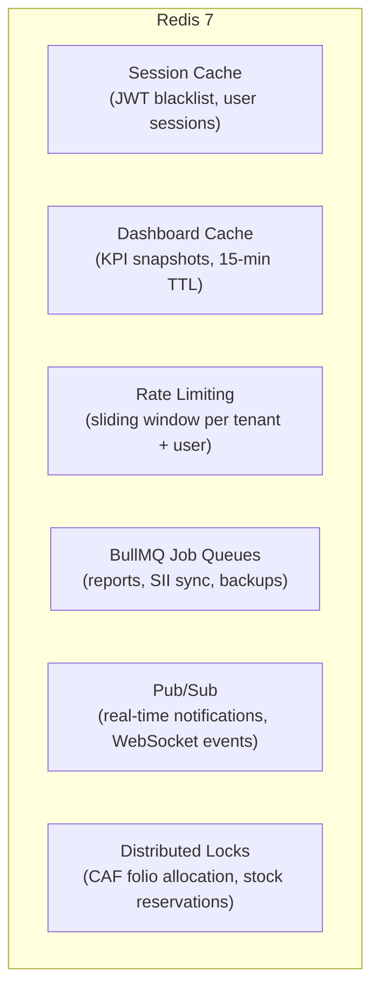

| Use Case | Redis Feature | TTL/Policy |
|----------|--------------|------------|
| Session cache | String key-value | 15 min (access), 7 days (refresh) |
| Dashboard KPIs | Hash + JSON | 15 min, refreshed by materialized view worker |
| Rate limiting | Sorted sets (sliding window) | 100 req/min per user, 1000 req/min per tenant |
| Background jobs | BullMQ queues | Report generation, SII XML submission, backup jobs, email dispatch |
| Real-time notifications | Pub/Sub channels | OT status changes, low-stock alerts, approval requests |
| Distributed locks | Redlock | CAF folio allocation (prevent duplicate folio assignment), stock reservation during checkout |
| Exchange rate cache | String key-value | 24 hours (daily rates from Banco Central) |

### 4.3 Database Schema Summary (51+ Tables)

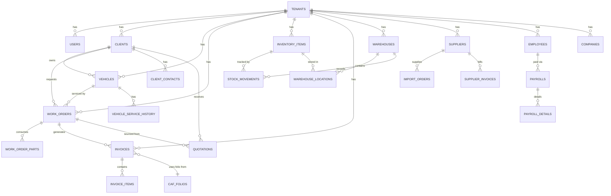

**Table groups by domain:**

| Domain | Tables | Count |
|--------|--------|-------|
| Core Identity | tenants, users, refresh_tokens | 3 |
| CRM | clients, client_contacts, customer_accesses, customer_tickets, customer_messages | 5 |
| Vehicles | vehicles, vehicle_service_history | 2 |
| Operations | work_orders, work_order_parts, quotations | 3 |
| Inventory/WMS | inventory_items, warehouses, warehouse_locations, stock_locations, stock_movements, picking_orders, picking_order_items, goods_receipts, goods_receipt_items | 9 |
| Supply Chain | suppliers, import_orders, import_order_items, traceability_chain | 4 |
| Financial | invoices, invoice_items, caf_folios, supplier_invoices, supplier_invoice_items, supplier_payments, client_payments, companies, exchange_rates | 9 |
| HR | employees, payrolls, payroll_details, attendance | 4 |
| System | audit_logs, notifications, automation_rules, approvals, external_accesses, import_update_logs, onboarding_progress, report_requests, data_exports, backup_records, storage_metrics | 11 |
| **Total** | | **50+** |

---

## 5. Module Architecture (Domain-Driven Design)

Each module is a bounded context with its own entities, services, controllers, and DTOs. Modules are organized into phases based on business priority.

### 5.1 Core Modules -- Phase 1 (MVP)

#### 5.1.1 Service Orders (Ordenes de Trabajo -- OT)

**The heart of the workshop.** Every workshop's revenue flows through work orders.

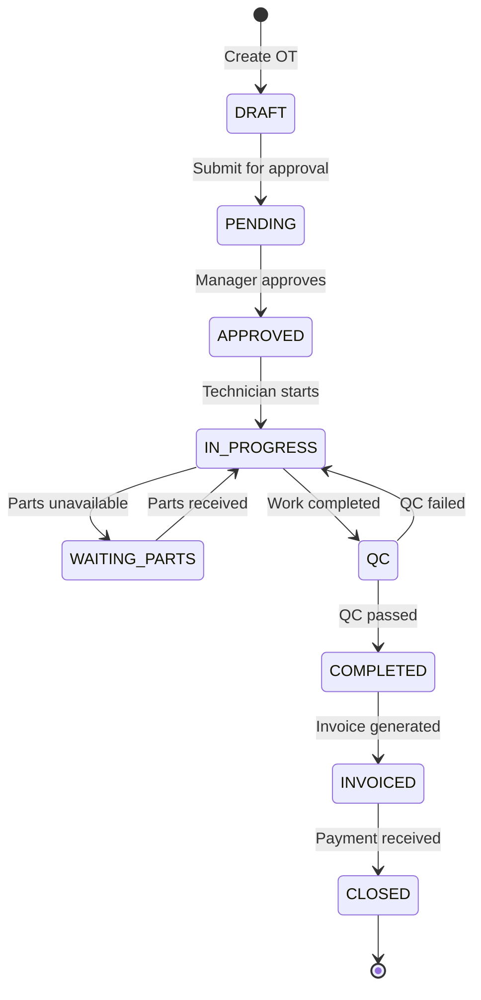

| Capability | Implementation |
|-----------|---------------|
| Create/Edit/Close work orders | Full CRUD with status validation (only valid transitions allowed) |
| Technician assignment + time tracking | `assigned_to` FK to users, `started_at`/`completed_at` timestamps, `estimated_hours`/`actual_hours` tracking |
| Parts consumption from inventory | `work_order_parts` junction table; adding a part triggers `stock_movements` (OUT type) and inventory deduction |
| Status workflow | State machine enforced in service layer; invalid transitions rejected with descriptive error |
| Photos/attachments per OT | Uploaded to Cloudflare R2, URLs stored in metadata JSONB column |
| Cost calculation | `labor_cost` + `parts_cost` = `total_cost`, auto-calculated on part add/remove |
| Quotation conversion | Approved quotations auto-generate work orders with pre-populated parts and costs |
| Customer notifications | Status changes trigger notifications via automation_rules (email, SMS, in-app) |

**NestJS Module:** `WorkOrdersModule`
**Key Files:** `work-orders.service.ts`, `work-orders.controller.ts`, `work-order.entity.ts`, `work-order-part.entity.ts`

#### 5.1.2 Inventory / WMS (Warehouse Management System)

**Parts management with enterprise-grade warehouse operations.**

| Capability | Implementation |
|-----------|---------------|
| Multi-warehouse support | `warehouses` table with types: MAIN, WORKSHOP, TRANSIT, RETURNS |
| Bin/shelf locations | `warehouse_locations` table (aisle, rack, shelf, bin) with `stock_locations` mapping |
| Stock movements | Every stock change (IN, OUT, TRANSFER, ADJUST) logged in `stock_movements` with full audit trail |
| Minimum stock alerts | `min_stock` column on inventory_items; automation_rule triggers notification when `stock_quantity <= min_stock` |
| Barcode/QR scanning | Frontend supports barcode scanner input for SKU/part_number lookup; QR codes generated for warehouse locations |
| Purchase orders + supplier management | Linked via `suppliers` table, with purchase order workflow and goods receipt confirmation |
| Lot tracking | FIFO costing via weighted average cost recalculation on every goods receipt |
| OEM/Aftermarket cross-reference | `part_number` (aftermarket) and `oem_number` fields; Meilisearch indexes both for cross-reference search |
| Picking orders | `picking_orders` + `picking_order_items` for warehouse fulfillment of work order parts |
| Goods receipts | Inbound receiving with quantity verification, cost update, and location assignment |

**Costing Method:**

```
Weighted Average Cost = (Current Stock * Current Avg Cost + New Qty * New Unit Cost)
                        / (Current Stock + New Qty)
```

Recalculated atomically on every `goods_receipt_items` INSERT within a transaction.

**NestJS Modules:** `InventoryModule`, `WmsModule`

#### 5.1.3 CRM (Clients + Vehicles)

**Customer relationship management tailored for automotive workshops.**

| Capability | Implementation |
|-----------|---------------|
| Customer profiles | `clients` table with type (PERSON/COMPANY), RUT validation, multi-contact support via `client_contacts` |
| Vehicle fleet per client | One-to-many relationship: client -> vehicles |
| VIN decoder | VIN validation (check digit algorithm) + planned integration with NHTSA API for vehicle specs |
| Service history per vehicle | `vehicle_service_history` table + queryable through all work orders linked to the vehicle |
| Automated reminders | `automation_rules` with triggers: last_service_date + interval -> send reminder (oil change, inspection due, etc.) |
| Communication log | `customer_tickets` + `customer_messages` for structured communication; notes field on client for unstructured |
| Customer self-service portal | `CustomerPortalModule` with PIN-based auth (`customer_accesses`), allowing clients to view OT status, invoices, and vehicle history |
| Sales pipeline integration | Client linked to `SalesPipelineModule` for lead tracking: LEAD -> CONTACTED -> QUOTED -> NEGOTIATION -> WON/LOST |

**NestJS Modules:** `ClientsModule`, `VehiclesModule`, `CustomerPortalModule`

#### 5.1.4 Invoicing / Billing (SII Chile Compliant)

**Full electronic invoicing compliance with Chile's Servicio de Impuestos Internos.**

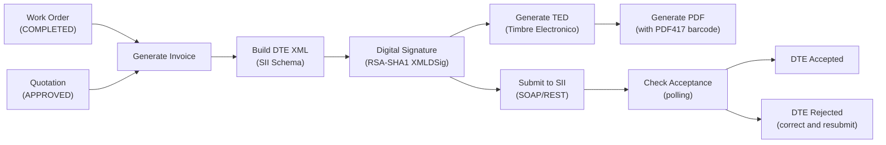

| DTE Type | Code | Description |
|----------|------|-------------|
| Factura Electronica | 33 | B2B invoice (IVA included) |
| Factura Exenta | 34 | Tax-exempt invoice |
| Boleta Electronica | 39 | B2C receipt |
| Nota de Debito | 56 | Debit note (price increase) |
| Nota de Credito | 61 | Credit note (returns, corrections) |
| Guia de Despacho | 52 | Dispatch guide (transport document) |

| Capability | Status |
|-----------|--------|
| DTE XML generation (full SII schema) | Implemented |
| RUT validation (Modulo 11) | Implemented |
| Invoice CRUD + filtering + pagination | Implemented |
| Invoice from Work Order (auto-build items) | Implemented |
| Invoice from Quotation | Implemented |
| Credit Notes (3 types: void, text correction, amount correction) | Implemented |
| CAF upload, parsing, folio management | Implemented |
| Monthly totals by DTE type | Implemented |
| Role-based access (OPERATOR, MANAGER, ADMIN) | Implemented |
| DTE digital signature (RSA-SHA1 XMLDSig) | Stubbed -- CRITICAL |
| TED generation (Timbre Electronico) | Stubbed -- CRITICAL |
| SII submission (auth flow + upload) | Stubbed -- CRITICAL |
| SII status check | Stubbed -- CRITICAL |
| PDF generation with PDF417 barcode | Not started -- MEDIUM |
| Libro de Compras/Ventas (monthly books) | Not started -- MEDIUM |

**IVA Calculation:** 19% standard rate applied to all taxable invoices. Net + IVA = Total.

**NestJS Module:** `FacturacionModule`

#### 5.1.5 Dashboard / KPIs (Real-Time Business Intelligence)

**Configurable, real-time dashboard giving workshop owners a complete business picture.**

| KPI | Data Source | Refresh |
|-----|-----------|---------|
| Revenue (period) | `mv_daily_revenue` materialized view | 15 min |
| Costs and margins | work_orders (labor_cost + parts_cost) vs invoices (total) | 15 min |
| Technician productivity | work_orders grouped by assigned_to (hours, count, revenue) | 15 min |
| Inventory turnover | stock_movements (OUT) / avg(inventory_items.stock_quantity) | Daily |
| Customer retention | Repeat visits within 12 months / total unique clients | Daily |
| Top services | work_orders grouped by type, sorted by count/revenue | Daily |
| Top parts | work_order_parts grouped by part_id, sorted by quantity/revenue | Daily |
| Accounts receivable aging | invoices WHERE status != PAID, grouped by age buckets (0-30, 31-60, 61-90, 90+) | Real-time |
| Pipeline conversion | quotations by status / total quotations | Daily |
| Low stock alerts | inventory_items WHERE stock_quantity <= min_stock | Real-time (event-driven) |

Dashboards are cached in Redis with 15-minute TTL. Background workers refresh materialized views and update Redis caches. Users can configure which widgets appear on their personal dashboard.

**NestJS Module:** `DashboardModule`, `CommandCenterModule`

### 5.2 Advanced Modules -- Phase 2

#### 5.2.1 TORQUE Network -- B2B Marketplace (The Moat)

The strategic differentiator. A marketplace where workshops can trade parts with each other in real-time.

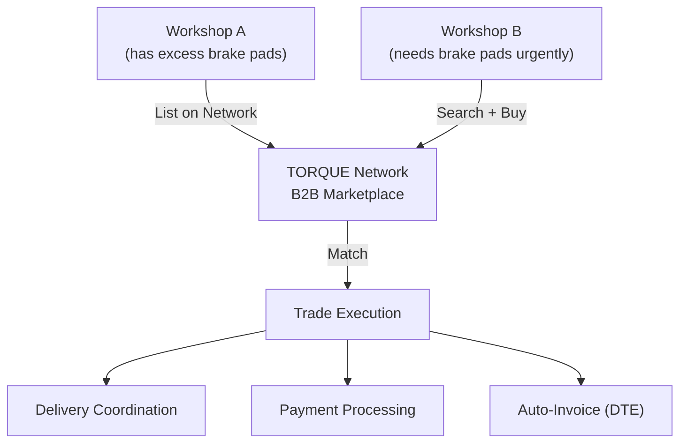

| Feature | Description |
|---------|-------------|
| Parts listing | Workshops list excess inventory with pricing, photos, and location |
| Search + matching | Fuzzy search across the entire network inventory; proximity-based results |
| Trade execution | Buy/sell with escrow payment; automated DTE generation for both parties |
| Reputation system | Ratings and reviews per workshop; trust score based on trade history |
| Delivery coordination | Integration with local courier services or workshop-to-workshop pickup |
| Network intelligence | Aggregate demand signals feed into RADAR and HUNTER analytics |

**Business model:** TORQUE 360 takes a 3-5% commission on each network trade, creating a revenue stream that grows with adoption and incentivizes network effects.

#### 5.2.2 AI Diagnostics (Genie-Powered)

| Feature | Description |
|---------|-------------|
| Symptom-based diagnosis | Technician describes symptoms; AI suggests likely causes ranked by probability |
| Vehicle history context | AI considers the specific vehicle's service history, mileage, and known issues |
| Parts recommendation | Suggested parts for each diagnosis, linked directly to inventory |
| Knowledge base | Continuously learning from resolved work orders across the network (anonymized) |
| Technical manuals | RAG-powered search through indexed technical documentation |

**Engine:** Genie AI system (Qwen2.5 LoRA fine-tuned on automotive domain) with embeddings for retrieval-augmented generation. Runs on-premises or via API -- no per-query cost to third-party LLM providers.

#### 5.2.3 Fleet Management

For corporate clients with vehicle fleets (taxis, delivery services, rental companies):

- Fleet vehicle tracking and status
- Scheduled maintenance programs
- Cost-per-vehicle analytics
- Driver assignment and history
- Compliance and inspection tracking
- Bulk work order creation

#### 5.2.4 HR / Payroll

Fully implemented for Chilean labor law:

| Feature | Detail |
|---------|--------|
| Employee records | RUT, contract type (indefinido/plazo fijo/honorarios), AFP, ISAPRE/FONASA |
| Monthly payroll | Auto-calculated: AFP (10% + variable), Salud (7%), Seguro Cesantia (0.6% + 2.4%), Impuesto Unico (progressive), Gratificacion (Art. 47 or Art. 50) |
| Attendance | Check-in/out, overtime tracking, medical leave, vacation |
| UF/UTM integration | Monthly values from Banco Central for real-value calculations |
| Payslips | PDF generation with full breakdown of haberes and descuentos |

**NestJS Module:** `RrhhModule`

#### 5.2.5 Accounting (Full Double-Entry General Ledger)

Phase 2 module that adds a complete accounting system:

| Feature | Detail |
|---------|--------|
| Chart of accounts | Configurable per tenant, pre-loaded with Chilean PCGA (Plan de Cuentas) |
| Journal entries | Every financial transaction creates balanced debit/credit entries |
| General ledger | Complete transaction history with drill-down to source documents |
| Trial balance | Real-time balance verification |
| Financial statements | Balance sheet, income statement, cash flow (auto-generated) |
| Bank reconciliation | Match bank statements with journal entries |
| Multi-currency | CLP primary, USD/EUR/CNY for imports, daily exchange rate conversion |

---

## 6. Data Export and Snapshot System

One of TORQUE 360's differentiators is **full data portability**. A workshop owner should be able to export an exact snapshot of their entire business at any point in time, in any format. No vendor lock-in.

### 6.1 Company Snapshot

A single action that exports the complete state of a tenant across all modules:

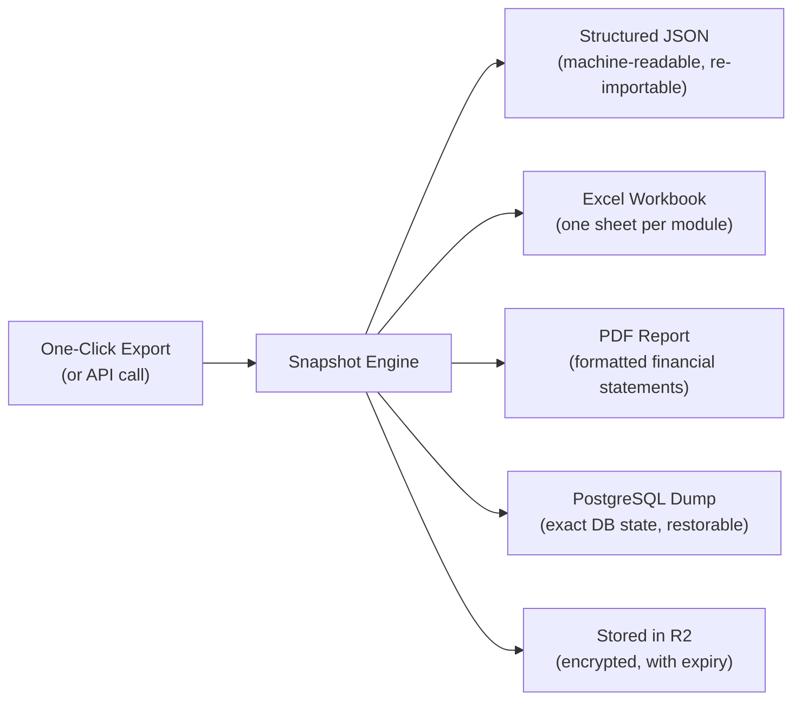

| Format | Contents | Use Case |
|--------|----------|----------|
| **Structured JSON** | All entities with relationships preserved, schema version, export timestamp | Re-import to another TORQUE 360 instance, migration, API consumption |
| **Excel Workbook** | Sheets: Clients, Vehicles, Work Orders, Inventory, Invoices, Employees, Financial Summary | Accountant review, auditor access, manual analysis |
| **PDF Report** | Financial statements, inventory valuation, AR aging, KPI summary, employee roster | Board presentations, bank loan applications, due diligence |
| **PostgreSQL Dump** | `pg_dump` of all tenant-scoped rows with schema | Disaster recovery, legal compliance, data archival |

### 6.2 Point-in-Time Queries

Using the temporal tables described in Section 4.1:

```
GET /api/v1/snapshots/inventory?as_of=2025-03-15T00:00:00Z

Response: Full inventory state as it existed on March 15, 2025
- Every item with its stock_quantity, cost_price, sell_price at that point
- Warehouse locations as they were configured
- Pending purchase orders at that time
```

Supported temporal queries:
- Inventory state at date X
- Client list and vehicle fleet at date X
- Work order status and technician assignments at date X
- Financial position (invoices, payments, receivables) at date X
- Employee roster and payroll data at date X

### 6.3 Data Transformation API

```
POST /api/v1/exports/transform
{
  "source_format": "json",
  "target_format": "excel",
  "modules": ["inventory", "invoices", "clients"],
  "date_range": { "from": "2025-01-01", "to": "2025-12-31" },
  "filters": { "invoice_status": ["PAID", "SENT"] }
}
```

The export engine supports:
- Format conversion (JSON <-> Excel <-> CSV <-> PDF)
- Module filtering (export only specific domains)
- Date range filtering
- Status filtering
- Aggregation (raw data vs summarized)
- Scheduling (daily/weekly/monthly automated exports)
- Webhook notification on export completion

Exports are processed as background jobs (BullMQ), stored in Cloudflare R2 with configurable retention (default 90 days), and tracked in the `data_exports` table with status, file URL, size, and SHA-256 checksum.

### 6.4 Audit Trail

Every data mutation across the entire system is logged:

```json
{
  "id": "uuid",
  "tenant_id": "uuid",
  "user_id": "uuid",
  "entity_type": "work_orders",
  "entity_id": "uuid",
  "action": "UPDATE",
  "changes": {
    "status": { "old": "IN_PROGRESS", "new": "COMPLETED" },
    "actual_hours": { "old": 3.5, "new": 5.0 },
    "completed_at": { "old": null, "new": "2025-03-15T14:30:00Z" }
  },
  "metadata": {
    "ip": "190.20.xxx.xxx",
    "user_agent": "Mozilla/5.0...",
    "source": "web"
  },
  "prev_hash": "a1b2c3d4...",
  "hash": "e5f6g7h8...",
  "created_at": "2025-03-15T14:30:00.123Z"
}
```

**Hash chain integrity:** Each audit log entry's `hash` is computed as `SHA-256(prev_hash + entity_type + entity_id + action + changes + created_at)`. This creates a tamper-evident chain -- modifying any historical entry breaks the chain, which is detectable by the integrity verification job (runs daily via cron).

---

## 7. API Architecture

### 7.1 API Design Principles

- **RESTful:** Standard HTTP methods (GET, POST, PATCH, DELETE) with consistent URL patterns
- **Versioned:** `/api/v1/` prefix, with backward-compatible evolution
- **Authenticated:** Every request (except health checks) requires a valid JWT Bearer token
- **Tenant-scoped:** Tenant ID extracted from JWT payload, set as PostgreSQL session variable
- **Paginated:** All list endpoints support `?page=1&limit=20&sort=created_at&order=desc`
- **Filtered:** Query parameters for field-specific filtering (e.g., `?status=IN_PROGRESS&assigned_to=uuid`)
- **Documented:** Auto-generated OpenAPI 3.0 spec from NestJS decorators

### 7.2 Endpoint Map

```
/api/v1/
│
├── /auth/
│   ├── POST   /login              — Authenticate (email + password)
│   ├── POST   /register           — Register new tenant + owner
│   ├── POST   /refresh            — Refresh access token
│   ├── POST   /logout             — Invalidate refresh token
│   ├── POST   /mfa/setup          — Generate TOTP secret + QR (planned)
│   └── POST   /mfa/verify         — Validate TOTP code (planned)
│
├── /tenants/
│   ├── GET    /                    — List tenants (SUPER_ADMIN only)
│   ├── GET    /:id                 — Get tenant details
│   ├── PATCH  /:id                 — Update tenant settings
│   └── PATCH  /:id/deactivate     — Deactivate tenant
│
├── /users/
│   ├── GET    /                    — List users (within tenant)
│   ├── GET    /:id                 — Get user profile
│   ├── POST   /                    — Create user (ADMIN invites)
│   ├── PATCH  /:id                 — Update user
│   └── PATCH  /:id/role           — Change user role
│
├── /work-orders/
│   ├── GET    /                    — List OTs (paginated, filtered)
│   ├── GET    /:id                 — Get OT detail with parts
│   ├── POST   /                    — Create OT
│   ├── PATCH  /:id                 — Update OT
│   ├── PATCH  /:id/status         — Transition OT status
│   ├── POST   /:id/parts          — Add part to OT
│   ├── DELETE /:id/parts/:partId  — Remove part from OT
│   ├── POST   /:id/photos         — Upload photos
│   └── GET    /stats              — OT statistics
│
├── /inventory/
│   ├── GET    /                    — List inventory items
│   ├── GET    /:id                 — Get item detail
│   ├── POST   /                    — Create item
│   ├── PATCH  /:id                 — Update item
│   ├── GET    /low-stock           — Items below minimum
│   ├── POST   /adjust             — Stock adjustment
│   └── GET    /stats              — Inventory statistics
│
├── /wms/
│   ├── GET    /warehouses          — List warehouses
│   ├── POST   /warehouses          — Create warehouse
│   ├── GET    /movements           — Stock movement history
│   ├── POST   /transfer            — Inter-warehouse transfer
│   ├── POST   /picking-orders      — Create pick list
│   └── POST   /goods-receipts      — Record goods receipt
│
├── /clients/
│   ├── GET    /                    — List clients
│   ├── GET    /:id                 — Client detail with vehicles
│   ├── POST   /                    — Create client
│   ├── PATCH  /:id                 — Update client
│   ├── GET    /:id/history         — Service history
│   └── GET    /stats              — CRM statistics
│
├── /vehicles/
│   ├── GET    /                    — List vehicles
│   ├── GET    /:id                 — Vehicle detail with history
│   ├── POST   /                    — Register vehicle
│   ├── PATCH  /:id                 — Update vehicle
│   └── GET    /:id/service-history — Complete service timeline
│
├── /quotations/
│   ├── GET    /                    — List quotations
│   ├── GET    /:id                 — Quotation detail
│   ├── POST   /                    — Create quotation
│   ├── PATCH  /:id                 — Update quotation
│   ├── PATCH  /:id/status         — Approve/reject quotation
│   └── POST   /:id/convert        — Convert to work order
│
├── /invoicing/
│   ├── GET    /                    — List invoices
│   ├── GET    /:id                 — Invoice detail with DTE XML
│   ├── POST   /                    — Create invoice
│   ├── POST   /from-work-order    — Generate from OT
│   ├── POST   /from-quotation     — Generate from quotation
│   ├── POST   /credit-note        — Create credit note (DTE 61)
│   ├── POST   /:id/send-sii       — Submit to SII
│   ├── GET    /:id/sii-status     — Check SII acceptance
│   ├── POST   /caf/upload         — Upload CAF file
│   ├── GET    /caf/status          — CAF folio availability
│   ├── PATCH  /:id/void           — Void invoice
│   ├── PATCH  /:id/mark-paid      — Record payment
│   └── GET    /monthly-totals     — Monthly aggregates by DTE type
│
├── /suppliers/
│   ├── GET    /                    — List suppliers
│   ├── POST   /                    — Create supplier
│   ├── GET    /:id/invoices        — Supplier invoices
│   └── POST   /:id/payments       — Record payment to supplier
│
├── /imports/
│   ├── GET    /                    — List import orders
│   ├── POST   /                    — Create import order
│   ├── PATCH  /:id/status         — Update import status
│   └── GET    /:id/landed-cost    — Calculate landed cost
│
├── /traceability/
│   ├── GET    /chain/:partId      — Full traceability chain for a part
│   └── GET    /vehicle/:vehicleId — All parts installed in vehicle
│
├── /reports/
│   ├── GET    /                    — List available reports
│   ├── POST   /generate           — Generate custom report
│   ├── GET    /exports             — List data exports
│   └── POST   /exports            — Create data export
│
├── /snapshots/
│   ├── POST   /company            — Generate full company snapshot
│   ├── GET    /inventory           — Point-in-time inventory query
│   ├── GET    /financials          — Point-in-time financial position
│   └── GET    /                    — List available snapshots
│
├── /dashboard/
│   ├── GET    /kpis               — Main KPI dashboard data
│   ├── GET    /revenue            — Revenue analytics
│   ├── GET    /productivity       — Technician productivity
│   └── GET    /widgets            — Configurable widget data
│
├── /rrhh/
│   ├── GET    /employees          — List employees
│   ├── POST   /employees          — Create employee
│   ├── POST   /payroll/calculate  — Calculate monthly payroll
│   ├── GET    /attendance         — Attendance records
│   └── POST   /attendance/check   — Check in/out
│
├── /approvals/
│   ├── GET    /pending            — My pending approvals
│   ├── POST   /:id/approve       — Approve request
│   └── POST   /:id/reject        — Reject request
│
├── /network/                       — TORQUE Network B2B (Phase 2)
│   ├── GET    /listings           — Browse network inventory
│   ├── POST   /listings           — List parts for sale
│   ├── POST   /orders             — Purchase from network
│   └── GET    /reputation         — Workshop reputation score
│
├── /ai/                            — Genie AI (Phase 2)
│   ├── POST   /diagnose           — Symptom-based diagnosis
│   ├── POST   /recommend-parts    — Parts recommendation
│   └── POST   /search-docs        — Technical documentation search
│
├── /webhooks/
│   ├── GET    /                    — List webhook subscriptions
│   ├── POST   /                    — Create webhook subscription
│   └── DELETE /:id                — Remove subscription
│
├── /admin/
│   ├── GET    /system-health      — System health dashboard
│   ├── GET    /storage            — Tenant storage usage
│   ├── POST   /backup             — Trigger manual backup
│   └── GET    /audit-log          — System-wide audit log (SUPER_ADMIN)
│
└── /health/
    ├── GET    /                    — Basic health check (no auth)
    └── GET    /ready              — Readiness probe (DB + Redis + Meili)
```

### 7.3 API Response Format

All responses follow a consistent envelope:

```json
{
  "success": true,
  "data": { ... },
  "meta": {
    "page": 1,
    "limit": 20,
    "total": 150,
    "totalPages": 8
  },
  "timestamp": "2025-03-15T14:30:00.123Z"
}
```

Error responses:

```json
{
  "success": false,
  "error": {
    "code": "FORBIDDEN",
    "message": "Insufficient permissions to void invoice",
    "details": { "required_role": "MANAGER", "current_role": "OPERATOR" }
  },
  "timestamp": "2025-03-15T14:30:00.123Z"
}
```

---

## 8. Security Architecture

### 8.1 Defense in Depth

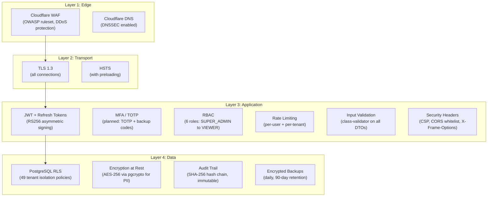

### 8.2 Authentication Flow

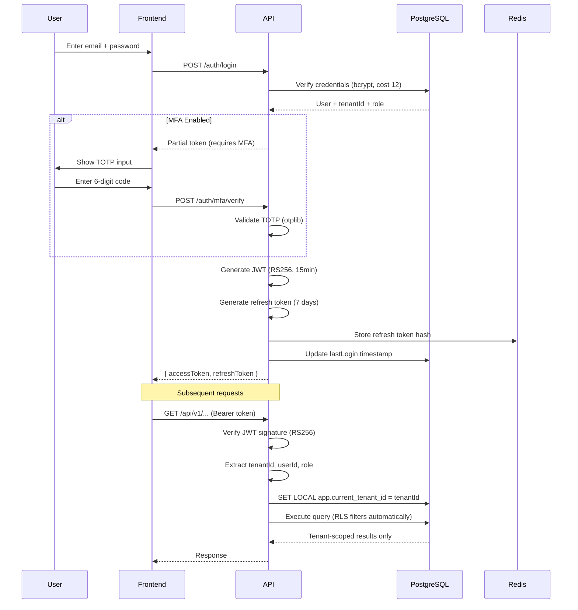

### 8.3 Role-Based Access Control (RBAC)

| Role | Scope | Capabilities |
|------|-------|-------------|
| **SUPER_ADMIN** | Cross-tenant | System configuration, view all tenants, bypass RLS via X-Tenant-Id header, system-wide audit log |
| **OWNER** | Tenant-wide | Full access: billing, user management, tenant settings, all modules. Cannot be deleted. |
| **ADMIN** | Tenant-wide | Manage users, approve quotes and credit notes, view financials, configure automations, CAF management |
| **MANAGER** | Operational | Create/edit OTs and quotes, manage inventory, view reports, approve standard operations |
| **OPERATOR** | Task-level | Work on assigned OTs, update parts, log time, view own work. Cannot access financial data |
| **VIEWER** | Read-only | View dashboards, reports, and data. Cannot create or modify anything |

Permissions are enforced at three levels:
1. **NestJS Guards** (`@Roles(Role.ADMIN, Role.MANAGER)`) on controller methods
2. **Service-level checks** for complex business rules (e.g., "only the assigned technician or a MANAGER can update an OT")
3. **PostgreSQL RLS** as the ultimate safety net (even if application logic has a bug, RLS prevents cross-tenant access)

### 8.4 Data Classification (Chilean Ley 19.628 + 21.719)

| Level | Classification | Examples | Protection |
|-------|---------------|----------|------------|
| **C4** | CRITICAL | RUT, passwords, digital certificates, CAF private keys | AES-256-GCM encryption, access logging, MFA required |
| **C3** | CONFIDENTIAL | Personal data, financial records, payroll, bank details | Encrypted at rest, role-restricted access |
| **C2** | INTERNAL | Business data, inventory, work orders, quotations | RLS isolation, audit trail |
| **C1** | PUBLIC | Marketing content, public API documentation | No special protection |

### 8.5 Threat Model (STRIDE)

| Threat | Mitigation |
|--------|-----------|
| **Spoofing** | JWT with RS256 (asymmetric), refresh token rotation, MFA for admin roles |
| **Tampering** | Input validation (class-validator), SQL parameterization, CSRF tokens, hash-chained audit log |
| **Repudiation** | Immutable audit trail with SHA-256 chain, centralized logging, IP tracking |
| **Information Disclosure** | RLS (49 policies), PII encryption (pgcrypto), TLS 1.3, minimal error messages |
| **Denial of Service** | Cloudflare WAF + DDoS protection, rate limiting (per-user + per-tenant), resource limits in Docker |
| **Elevation of Privilege** | RBAC guards at controller + service + database layers, principle of least privilege |

### 8.6 API Security Measures

| Measure | Implementation |
|---------|---------------|
| Rate limiting | 100 requests/min per user, 1000 requests/min per tenant (configurable) |
| CORS | Strict whitelist: only `torque360.cl` and configured origins |
| CSP | Content Security Policy headers blocking inline scripts and unauthorized sources |
| Input validation | All DTOs validated with class-validator decorators; RUT regex, DTE type whitelists, numeric ranges |
| SQL injection prevention | TypeORM parameterized queries only; no string concatenation in SQL |
| XSS prevention | React (auto-escapes), CSP headers, sanitized user input |
| Request signing | Financial operations (invoices, payments) require additional verification (planned) |
| API versioning | `/api/v1/` prefix; breaking changes only in new major versions |

---

## 9. Scalability Plan

### 9.1 Current Capacity (Phase 1)

| Metric | Target | How |
|--------|--------|-----|
| Concurrent users | 500 | NestJS async, PostgreSQL connection pool |
| Tenants | 100 | RLS-based isolation, single database |
| API latency (P95) | < 200ms | Redis caching, materialized views, optimized queries |
| Database size | 50 GB | PostgreSQL with indexes, no unstructured blobs (R2 for files) |

### 9.2 Scale-Up Path (100-500 Tenants)

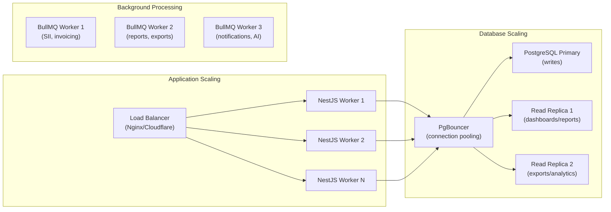

| Scaling Action | Trigger | Implementation |
|---------------|---------|----------------|
| Horizontal API scaling | CPU > 70% sustained | Multiple NestJS instances behind Nginx/Cloudflare load balancer |
| PgBouncer connection pooling | Connection count > 100 | PgBouncer in transaction mode, pool size 25 per backend |
| Read replicas | Dashboard/report queries slow | PostgreSQL streaming replication; route read-only queries to replicas |
| Table partitioning | audit_logs > 10M rows | RANGE partition by month (created_at) |
| Background worker scaling | Job queue depth > 1000 | Additional BullMQ worker processes |
| Redis cluster | Memory > 80% or latency > 5ms | Redis Sentinel for HA, then Redis Cluster for horizontal scale |

### 9.3 Scale-Out Path (500-5000+ Tenants)

| Phase | Action | Trigger |
|-------|--------|---------|
| Phase 3a | Kubernetes (K8s) orchestration | > 500 tenants, need auto-scaling |
| Phase 3b | Database sharding by tenant group | > 1000 tenants or > 500 GB database |
| Phase 3c | TORQUE Network as separate microservice | Network traffic exceeds 30% of total API load |
| Phase 3d | Multi-region deployment | Expansion beyond Chile (Colombia, Peru, Mexico) |
| Phase 3e | Dedicated tenant databases | Enterprise customers requiring physical data isolation |

### 9.4 Performance Optimization Strategy

| Area | Technique | Target |
|------|-----------|--------|
| API responses | Redis cache with 15-min TTL for dashboard data | P95 < 100ms for cached endpoints |
| Database queries | Materialized views for aggregations; partial indexes for hot queries | P95 < 50ms for indexed queries |
| Search | Meilisearch with pre-built indexes; PostgreSQL FTS as fallback | P95 < 30ms for search results |
| File uploads | Direct-to-R2 presigned URLs (bypass API) | No API bottleneck for file uploads |
| Reports | Background generation (BullMQ); pre-computed for common reports | Generation < 30s for standard reports |
| Bulk operations | Batch inserts/updates with chunking (1000 rows per chunk) | Import 10K inventory items in < 60s |

---

## 10. Technology Decisions

### 10.1 Decision Matrix

| Component | Choice | Why | Alternatives Considered |
|-----------|--------|-----|------------------------|
| **Runtime** | Node.js 22+ | Async I/O, single-language stack (TS front+back), massive ecosystem | Python (FastAPI), Go |
| **Backend Framework** | NestJS 11 | Modular architecture, TypeScript-native, DI container, guards/interceptors, excellent documentation | Express (too minimal), Fastify (fewer patterns) |
| **ORM** | TypeORM | Decorator-based entities, migration support, works with NestJS DI, supports complex joins | Prisma (less SQL control), Drizzle (newer, less battle-tested) |
| **Database** | PostgreSQL 17 | RLS for multi-tenancy, temporal tables, JSONB, FTS, partitioning, uuid-ossp, pgcrypto -- everything in one engine | MySQL (no RLS), CockroachDB (overkill at this stage) |
| **Cache/Queue** | Redis 7 | Sessions, caching, BullMQ queues, pub/sub, distributed locks -- single tool for all real-time needs | RabbitMQ (separate queue system), Memcached (no persistence) |
| **Search** | Meilisearch | Typo-tolerant, instant (<50ms), easy to deploy, no JVM (lighter than Elasticsearch) | Elasticsearch (heavier, JVM), Algolia (SaaS cost) |
| **Frontend Framework** | Next.js 15 + React | SSR/SSG for SEO (landing), App Router, RSC, TypeScript native, Vercel deployment | Remix (smaller ecosystem), SvelteKit (smaller team familiarity) |
| **UI Kit** | shadcn/ui + Tailwind CSS | Copy-paste components (no black-box dependency), accessible, modern, highly customizable | MUI (heavier, opinionated), Ant Design (less customizable) |
| **State Management** | (Frontend-local) | React Server Components + React Query for server state; Zustand for minimal client state | Redux (overkill), Jotai (too atomic) |
| **Auth** | JWT (RS256) + Passport | Stateless, works with RLS (tenantId in token), RS256 asymmetric for security | Session-based (not suitable for multi-tenant API-first) |
| **Object Storage** | Cloudflare R2 | S3-compatible, no egress fees, Cloudflare network integration | AWS S3 (egress costs), MinIO (self-hosted complexity) |
| **AI Engine** | Genie (Qwen2.5 LoRA) | On-premises, no per-query cost, domain-specific fine-tuning, full data privacy | OpenAI API (recurring cost, data leaves premises), Claude API (same concern) |
| **Payment Processing** | Transbank + Flow | Dominant Chilean payment processors; Webpay for cards, Flow for bank transfers | Stripe (not available in Chile for all use cases), MercadoPago (higher fees) |
| **Email** | ProtonMail Bridge | E2E encrypted, no third-party reading email content, compliant with Constitutional principle | SendGrid (reads content), AWS SES (reads content), Resend (reads content) |
| **Monorepo** | Turborepo + pnpm | Fast builds with caching, workspace-native, incremental builds | Nx (heavier), Lerna (deprecated) |
| **CI/CD** | GitHub Actions | Integrated with repository, free for open-source/small teams, Docker support | GitLab CI (need to migrate repo), CircleCI (cost) |
| **Containerization** | Docker Compose (dev), Docker (prod) | Standard, reproducible environments, compatible with any hosting | Podman (less ecosystem support) |

### 10.2 Technology Radar

| Category | Adopt | Trial | Assess | Hold |
|----------|-------|-------|--------|------|
| **Backend** | NestJS, TypeORM, BullMQ | GraphQL subscriptions | tRPC | Express (too minimal) |
| **Database** | PostgreSQL 17, Redis 7 | TimescaleDB (time-series) | ClickHouse (analytics) | MongoDB (no ACID for ERP) |
| **Frontend** | Next.js 15, shadcn/ui | React Server Components | Astro (marketing pages) | Create React App (deprecated) |
| **DevOps** | Docker, GitHub Actions | K8s (Hetzner K3s) | Terraform | Manual server provisioning |
| **AI** | Genie (Qwen2.5 LoRA) | RAG on technical manuals | Vision models (damage assessment) | GPT-4 API (cost/privacy) |

> **Note on Stack Divergence:** The project's `CLAUDE.md` references FastAPI + SQLAlchemy as the planned stack. The actual implementation uses **NestJS + TypeORM** as documented in the README and codebase. This architecture document reflects the real, implemented stack.

---

## 11. Deployment Architecture

### 11.1 Production Topology

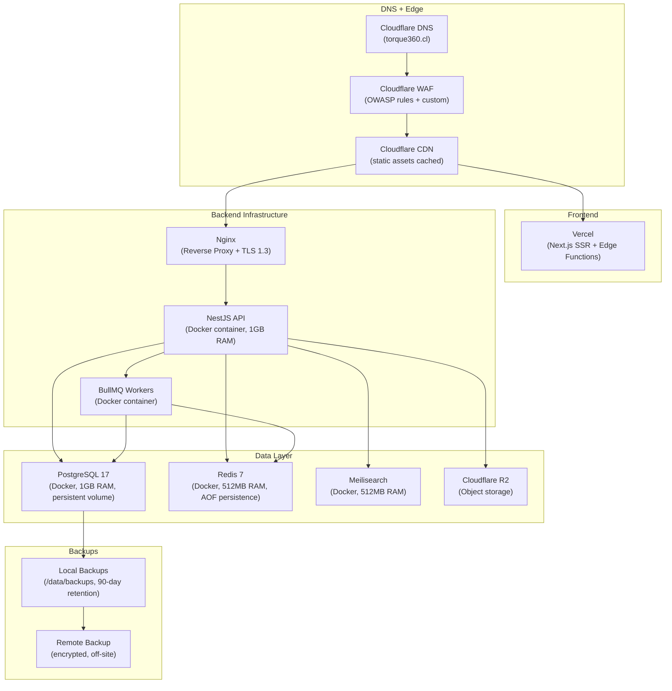

### 11.2 Environment Strategy

| Environment | Purpose | Infrastructure | Database | Access |
|-------------|---------|---------------|----------|--------|
| **Development** | Local development | Docker Compose (PG + Redis + Meili) | Local PG with seed data | All developers |
| **Staging** | Pre-production testing, UAT | Same as production but scaled down | Separate PG instance, masked data | Dev team + QA + stakeholders |
| **Production** | Live environment | Full Docker Compose with resource limits | Production PG with backups + retention | Restricted (deployment pipeline only) |

### 11.3 Resource Allocation (Production)

| Service | CPU Limit | Memory Limit | Memory Reserved | Persistent Storage |
|---------|-----------|-------------|----------------|--------------------|
| PostgreSQL 17 | 1.0 core | 1 GB | 256 MB | pg_data volume + pg_backups volume |
| Redis 7 | 0.5 core | 512 MB | 128 MB | redis_data volume (AOF) |
| Meilisearch | 0.5 core | 512 MB | 128 MB | meili_data volume |
| NestJS API | 1.0 core | 1 GB | 256 MB | None (stateless) |
| Next.js Web | 0.5 core | 512 MB | 128 MB | None (stateless) |
| Nginx | 0.25 core | 128 MB | -- | SSL certificates (read-only) |
| **Total** | **3.75 cores** | **3.625 GB** | **896 MB** | -- |

### 11.4 CI/CD Pipeline

```mermaid
flowchart LR
    PUSH["Git Push<br/>(main branch)"] --> LINT["Lint + Format<br/>(ESLint + Prettier)"]
    LINT --> TYPE["Type Check<br/>(tsc --noEmit)"]
    TYPE --> TEST["Unit Tests<br/>(Vitest, 80% coverage)"]
    TEST --> BUILD["Docker Build<br/>(api + web images)"]
    BUILD --> SCAN["Security Scan<br/>(Snyk/Trivy)"]
    SCAN --> STAGING["Deploy to Staging"]
    STAGING --> E2E["E2E Tests<br/>(Playwright)"]
    E2E --> APPROVE["Manual Approval"]
    APPROVE --> PROD["Deploy to Production"]
    PROD --> HEALTH["Health Check<br/>(readiness probe)"]
    HEALTH --> MONITOR["Monitor<br/>(15 min observation)"]
```

### 11.5 Backup Strategy

| Type | Frequency | Retention | Storage | Encryption |
|------|-----------|-----------|---------|-----------|
| Full database dump | Daily at 2:00 AM CLT | 90 days | Local + remote | AES-256 |
| WAL archiving | Continuous | 7 days | Local | Yes |
| Point-in-time recovery | Continuous (WAL-based) | 7 days | Local | Yes |
| Tenant-level export | On-demand + weekly (Sunday) | 90 days | Cloudflare R2 | AES-256 |
| Configuration backup | On every change | Indefinite | Git repository | -- |

Backup integrity verified via SHA-256 checksums stored in the `backup_records` table. A daily health check job verifies that the latest backup is restorable.

---

## 12. Competitive Positioning

### 12.1 Feature Comparison Matrix

| Feature | SAP Business One | Microsoft Dynamics 365 | Oracle NetSuite | Autologica | GDS | **TORQUE 360** |
|---------|-----------------|----------------------|----------------|------------|-----|---------------|
| **Monthly price** | $5,000+ | $1,000+ | $3,000+ | $500 | $300 | **$49-499** |
| **Automotive-specific** | No (generic ERP) | No (generic ERP) | No (generic ERP) | Yes | Yes | **Yes** |
| **AI diagnostics** | No | Copilot (generic) | No | No | No | **Yes (Genie)** |
| **B2B parts marketplace** | No | No | No | No | No | **Yes (TORQUE Network)** |
| **Modern UX** | Legacy UI | Partial modernization | Web-based but complex | Desktop legacy | Desktop legacy | **Modern web + mobile** |
| **Cloud-native** | Hybrid | Yes | Yes | On-premises | On-premises | **Yes (Docker/K8s)** |
| **Multi-tenant** | No (per-installation) | Yes | Yes | No | No | **Yes (RLS)** |
| **Data portability** | Complex extraction | Complex extraction | Complex extraction | Manual export | Manual export | **Full export (JSON/Excel/PDF/SQL)** |
| **Time-travel snapshots** | No | No | Limited | No | No | **Yes (temporal tables)** |
| **SII Chile compliance** | Partial (requires partner) | Partial (requires partner) | Partial (requires partner) | Yes (Chile focus) | Yes (Chile focus) | **Yes (native)** |
| **Chilean payroll** | Via partner module | Via partner module | Via partner module | No | No | **Yes (native)** |
| **API-first** | SOAP (legacy) | REST (limited) | REST | No public API | No public API | **Full REST API** |
| **Real-time dashboards** | Scheduled reports | Power BI integration | Built-in (complex) | Basic reports | Basic reports | **Real-time (Redis + materialized views)** |
| **Self-service customer portal** | No | No | Customer center (extra cost) | No | No | **Yes (included)** |
| **Setup time** | 3-6 months | 2-4 months | 2-4 months | 1-2 months | 1-2 months | **1-2 weeks** |
| **Requires consultants** | Yes ($$$) | Yes ($$) | Yes ($$$) | Optional | Optional | **No** |

### 12.2 Strategic Positioning

```
                    HIGH PRICE
                       |
           SAP --------+-------- Oracle
                       |
                       |
                       |
    LOW AUTOMOTIVE ----+---- HIGH AUTOMOTIVE
      SPECIFICITY      |       SPECIFICITY
                       |
        Dynamics ------+------ Autologica / GDS
                       |
                       |
                   TORQUE 360
                   (sweet spot)
                       |
                    LOW PRICE
```

TORQUE 360 occupies the **high automotive specificity + low price** quadrant that no competitor currently fills. The addition of AI diagnostics and the TORQUE Network creates a category of one.

### 12.3 Moat Analysis

| Moat Type | Description | Defensibility |
|-----------|-------------|--------------|
| **Network effects** | TORQUE Network: more workshops = more parts available = more value for each workshop | Strong -- grows exponentially with adoption |
| **Data advantage** | Aggregated anonymized data across all tenants powers Traccion consulting intelligence | Medium -- improves with scale |
| **AI advantage** | Genie trained on real workshop data; accuracy improves with more OTs processed | Medium -- requires continued investment |
| **Switching costs** | Full business data in the system; integrations with SII, suppliers, customers | Medium -- mitigated by data portability (deliberate choice to reduce lock-in, build trust) |
| **Price advantage** | 60-90% cheaper than alternatives with more features | Strong -- sustainable due to modern architecture (lower infra cost) |
| **Domain expertise** | Built by and for the Chilean automotive industry; native SII, payroll, local payment integration | Strong -- hard for generic ERPs to replicate |

### 12.4 TORQUE Network Flywheel

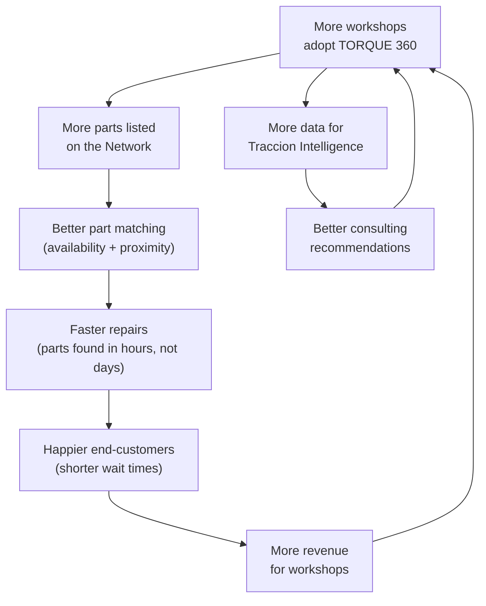

---

## Appendix A: Entity Relationship Summary

### Core Schema (init.sql)

| Table | Primary Key | Key Relationships | RLS |
|-------|-------------|-------------------|-----|
| tenants | UUID | Parent of all tenant-scoped tables | No (system-managed) |
| users | UUID | -> tenants (tenant_id) | Yes |
| refresh_tokens | UUID | -> users (user_id) | No (system) |
| vehicles | UUID | -> tenants, -> clients (client_id) | Yes |
| clients | UUID | -> tenants | Yes |
| work_orders | UUID | -> tenants, -> vehicles, -> clients, -> users (assigned_to) | Yes |
| work_order_parts | UUID | -> tenants, -> work_orders | Yes |
| quotations | UUID | -> tenants, -> vehicles, -> clients, -> users (created_by), -> work_orders | Yes |
| inventory_items | UUID | -> tenants | Yes |
| audit_logs | UUID | -> tenants, -> users | Yes |

### Extended Schema (Migrations 001-003)

| Migration | Tables Added | Domain |
|-----------|-------------|--------|
| 001 | client_contacts, warehouses, warehouse_locations, stock_locations, stock_movements, picking_orders, picking_order_items, goods_receipts, goods_receipt_items, suppliers, import_orders, import_order_items, traceability_chain, vehicle_service_history | WMS + Supply Chain |
| 002 | (Extends quotations + work_orders with pipeline fields) | Sales Pipeline |
| 003 | companies, exchange_rates, approvals, notifications, automation_rules, invoices, invoice_items, caf_folios, employees, payrolls, payroll_details, attendance, external_accesses, import_update_logs, supplier_invoices, supplier_invoice_items, supplier_payments, client_payments, customer_tickets, customer_messages, customer_accesses, onboarding_progress, report_requests, data_exports, backup_records, storage_metrics | Business Operations (26 tables) |

---

## Appendix B: Glossary

| Term | Definition |
|------|-----------|
| **OT** | Orden de Trabajo (Work Order) -- the fundamental unit of workshop operations |
| **DTE** | Documento Tributario Electronico -- SII electronic tax document |
| **SII** | Servicio de Impuestos Internos -- Chile's tax authority |
| **CAF** | Codigo de Autorizacion de Folios -- SII-issued authorization for invoice numbers with RSA keys |
| **TED** | Timbre Electronico del DTE -- Digital stamp embedded in each electronic document |
| **RUT** | Rol Unico Tributario -- Chilean tax identification number |
| **RLS** | Row-Level Security -- PostgreSQL feature that filters rows based on session context |
| **IVA** | Impuesto al Valor Agregado -- Chile's 19% value-added tax |
| **UF** | Unidad de Fomento -- Inflation-indexed currency unit used in Chile |
| **UTM** | Unidad Tributaria Mensual -- Monthly tax unit used for thresholds and fines |
| **AFP** | Administradora de Fondos de Pensiones -- Chilean pension fund administrators |
| **ISAPRE** | Instituciones de Salud Previsional -- Private health insurance in Chile |
| **FONASA** | Fondo Nacional de Salud -- Public health insurance in Chile |
| **WMS** | Warehouse Management System |
| **FIFO** | First In, First Out -- Inventory costing method |
| **RBAC** | Role-Based Access Control |
| **BullMQ** | Redis-based job queue for Node.js |
| **PCGA** | Principios de Contabilidad Generalmente Aceptados -- Chilean GAAP |
| **TORQUE Network** | B2B marketplace for inter-workshop parts trading -- the competitive moat |
| **Genie** | AI diagnostic engine powered by Qwen2.5 with domain-specific fine-tuning |

---

*This document is a living artifact. It will be updated as TORQUE 360 evolves through its development phases. All architectural decisions are documented with rationale to enable future team members to understand not just WHAT was built, but WHY.*

*Last updated: 2026-02-17 | Version: 1.0.0*
